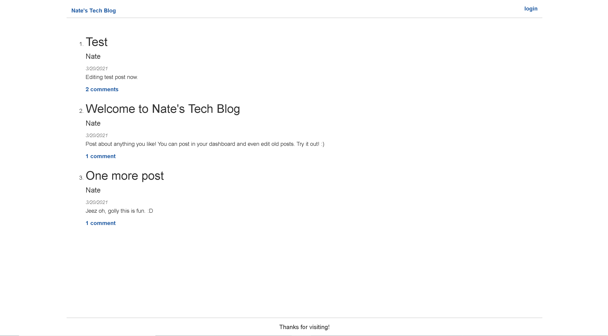
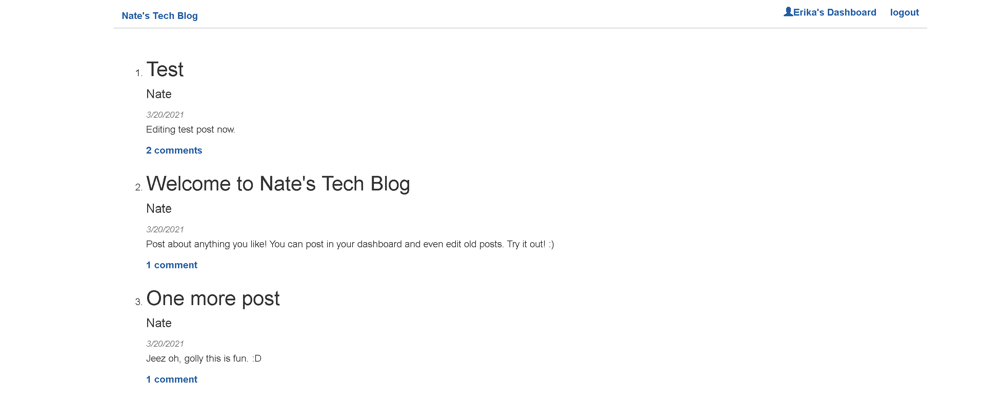
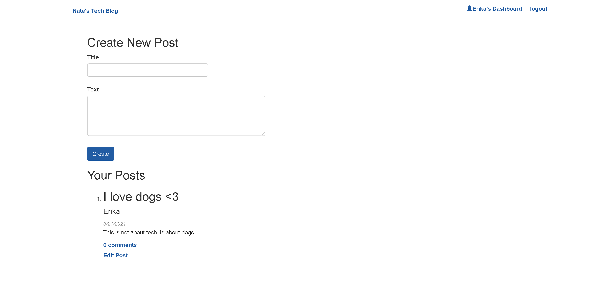
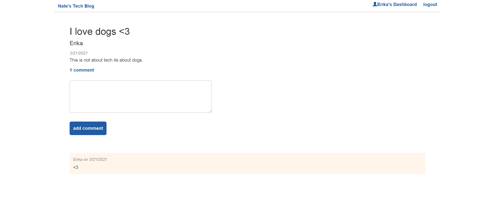
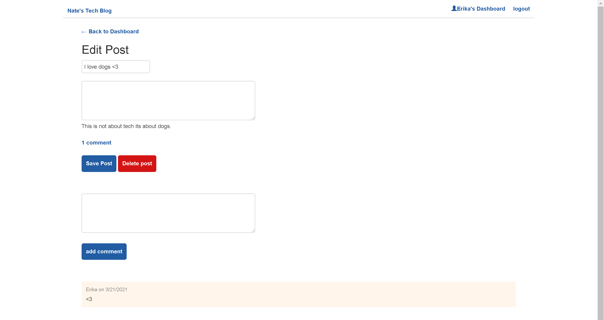

# MVC Tech Blog

## Table of Contents
1. [Description](#description)
2. [Installation](#installation)
3. [Usage](#usage)
4. [License](#license)
5. [Contributing](#contributing)
6. [Tests](#tests)
7. [Questions](#questions)

## Description
This is a basic CMS-style blog site that was created using the Model, View, Controller paradigm.  This site is currently hosted on Heroku at [Heroku Deployment](https://powerful-wave-29911.herokuapp.com/) and can also be run locally using the files located in the GitHub repository [Github](https://github.com/nystephens/mvc-tech-blog).  To learn how to run this server locally please continue reading the [Installation](#installation) and [Usage](#usage) sections.  

This application was created using Node.js, express for the server, and sequelize to connect to a mysql database entitled "tech_blog_db".  All user, post, and comment data is stored in tech_blog_db.  The live app is currently deployed on Heroku, using the JAWSDB add on to store data.  All passwords have been encrypted using the bcrypt Node.js package.  The HTML views templates are generated using Handlebars.js.

## Installation
1.  Navigate to the GitHub repository ( https://github.com/nystephens/mvc-tech-blog) in your web browser and click the green dropdown menu that says “Code”.  Copy the SSH key to your clipboard and then open your terminal.  

2.  In your terminal navigate to the directory you wish to house this repository.   

3.  Type “git clone” into your command line and paste the SSH key you copied from the repository, then hit Enter.  A new file titled “mvc-tech-blog” containing the necessary files will appear in your chosen directory.  Due to file size, Node.js and is necessary  modules will not be cloned to your repository.  Please continue reading the instructions to find out how to install these modules on your computer.   

4.  Since this application uses Node.js you will have to install Node and the required Node modules to operate it, make edits, and/or run the server locally.  For detailed instructions on how  to install Node.js to your computer please visit: https://www.guru99.com/download-install-node-js.html  

5.  Once Node is successfully installed on your computer, navigate to the project's root directory in your terminal.  For quick access you can right click the root directory in VS Code and click the option “Open in Integrated Terminal”. 

6.  Type the following command to install the proper node modules: “npm install”.  

7.  Check your newly downloaded “node_modules” folder to ensure that the correct packages have been installed.  The dependencies that are not included within the general Node module package are "bcrypt", "connect-session-sequelize", "dotenv", "express", "express-handlebars", "express-session","mysql2", "sequelize".  If these packages are not present within your Node modules folder then run the command “npm install \<package-name\>” to install the missing packages. 

8.  Once you have cloned the repository and downloaded Node.js and its necessary modules you are ready to run the server locally! See the next section, [Usage](#usage), for instructions on how to properly set up and seed the database with test data.

## Usage
Users of this site are allowed to veiw the homepage and current blog posts, but they are not allowed to create or interact with blog posts until they are signed in.  A click on the "login" button on the navbar will take the user to a page that asks for them to either log in or create a new user account.  Once the user account is created or existing user info is entered you will be signed in and able to create and edit your own posts as well as leave comments on posts.  The sign in session will end in 2 hours, after which the user will be automatically logged out.  To figure out how to adjust or eliminate this time limit see [Tests](#tests).

If you wish to run the serve locally you must first create and seed your MySQL database.  Before you can create and seed the database you must create your .env file.  

Right click on your root directory and add "New File".  Name your new file ".env" and populate it with the following information: 

DB_NAME=tech_blog_db

DB_USER=\<your mysql username\>

DB_PW=\<your mysql password\>

Once your .env file is created you will be able to run the source command in mysql.  Log into mysql by entering the command "mysql -u \<your mysql username\> -p"  in  your terminal in the root directory.  Enter your password.  Once you are logged in run the command "source db/schema.sql".  When that is finished with no errors you can quit out of mysql by running the command "quit".

Now that your database and tables are created you can seed the database with the mock info provided in the seeds folder.  In the terminal while located in the root directory run the command "npm run seed".

After your database is seeded with information you are able to view, edit, and make new posts using your local server.  To start the server type the command "npm start" into your terminal while in the root directory and navigate to http://localhost:3001/ in your browser.  This will take you to the hompeage and from there you can interact with the blog site.  To view the application in its current deployed environment visit [Heroku Deployment](https://nates-tech-blog.herokuapp.com/)

Here are some screenshots to demonstrate the functionality and show how the page is rendered.

Homepage Logged Out:

Homepage Logged In:

Dashboard:

Single Post with Comments:

Edit Post:

## License

[MIT license](https://opensource.org/licenses/MIT)
Copyright <YEAR> <COPYRIGHT HOLDER>

Permission is hereby granted, free of charge, to any person obtaining a copy of this software and associated documentation files (the "Software"), to deal in the Software without restriction, including without limitation the rights to use, copy, modify, merge, publish, distribute, sublicense, and/or sell copies of the Software, and to permit persons to whom the Software is furnished to do so, subject to the following conditions:

The above copyright notice and this permission notice shall be included in all copies or substantial portions of the Software.

THE SOFTWARE IS PROVIDED "AS IS", WITHOUT WARRANTY OF ANY KIND, EXPRESS OR IMPLIED, INCLUDING BUT NOT LIMITED TO THE WARRANTIES OF MERCHANTABILITY, FITNESS FOR A PARTICULAR PURPOSE AND NONINFRINGEMENT. IN NO EVENT SHALL THE AUTHORS OR COPYRIGHT HOLDERS BE LIABLE FOR ANY CLAIM, DAMAGES OR OTHER LIABILITY, WHETHER IN AN ACTION OF CONTRACT, TORT OR OTHERWISE, ARISING FROM, OUT OF OR IN CONNECTION WITH THE SOFTWARE OR THE USE OR OTHER DEALINGS IN THE SOFTWARE.

## Contributing
I would love to expand this project by adding cooler styling and additional features such as being able to post different content types and being able to search users or posts.  A hashtag feature could also be very handy and improve user experience.  Before contributing please read the entire README.md file and contact me via GitHub.  My GitHub info can be found in the final section of the README.md [Questions](#questions).

## Tests
To test this application you can run the server locally or navigate to the [Heroku Deployment](https://powerful-wave-29911.herokuapp.com/)  and test the functionality of the app.  You can even check the raw json data by entering the endpoints: "/api/users", "/api/posts", and "/api/comments" in your browser.  You will then be able to cross-reference the raw data with the data presented on the blog pages.  

To adjust the login session time limit as instructed in the [Usage](#usage) section go to the server.js file that is in the root directory.  Go the section where the session variable is defined "const sess = {...}" and in the sess object you will find a "cookie" object property.  Within that cookie object is an "expires" property.  The expires property take an integer argument calculated in milliseconds.  For use on the deployed app I have the expires property set to 2 hours, but you can set it to even lower to test the auto-logout feature.

## Questions
For questions or concerns regarding this project or future collaborations please contact the author via GitHub at:
https://github.com/nystephens
